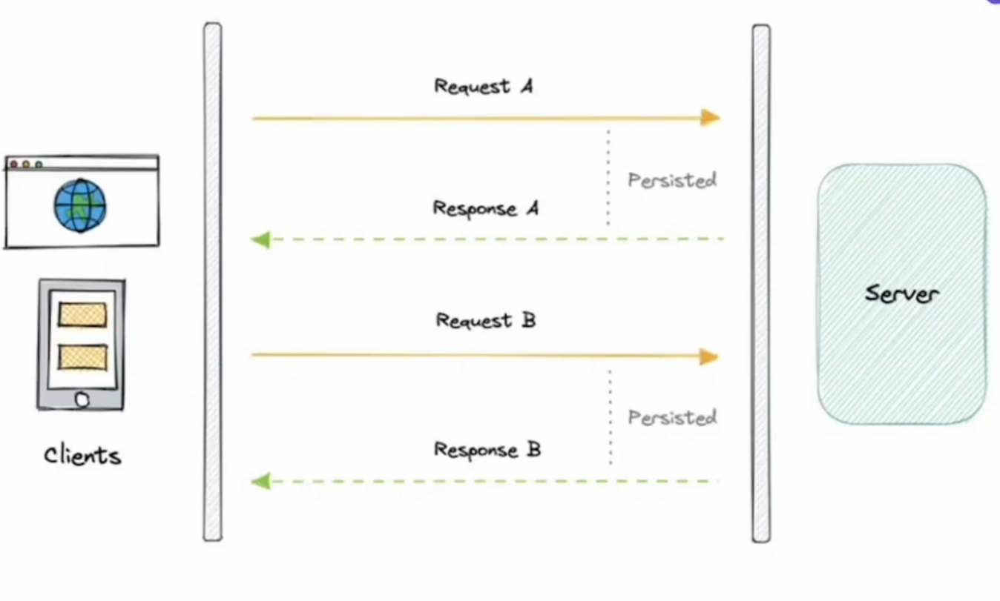

### Overview of Short Polling
- Short Live Connection
- No Persistent Connection
- Less Resource Utility
- Problem occurs with scale
	- Say if 10 users keep making 10 req per min to the server, it might overload the server

### Example
* Real time system
* Notification
* CricInfo
* Version update
